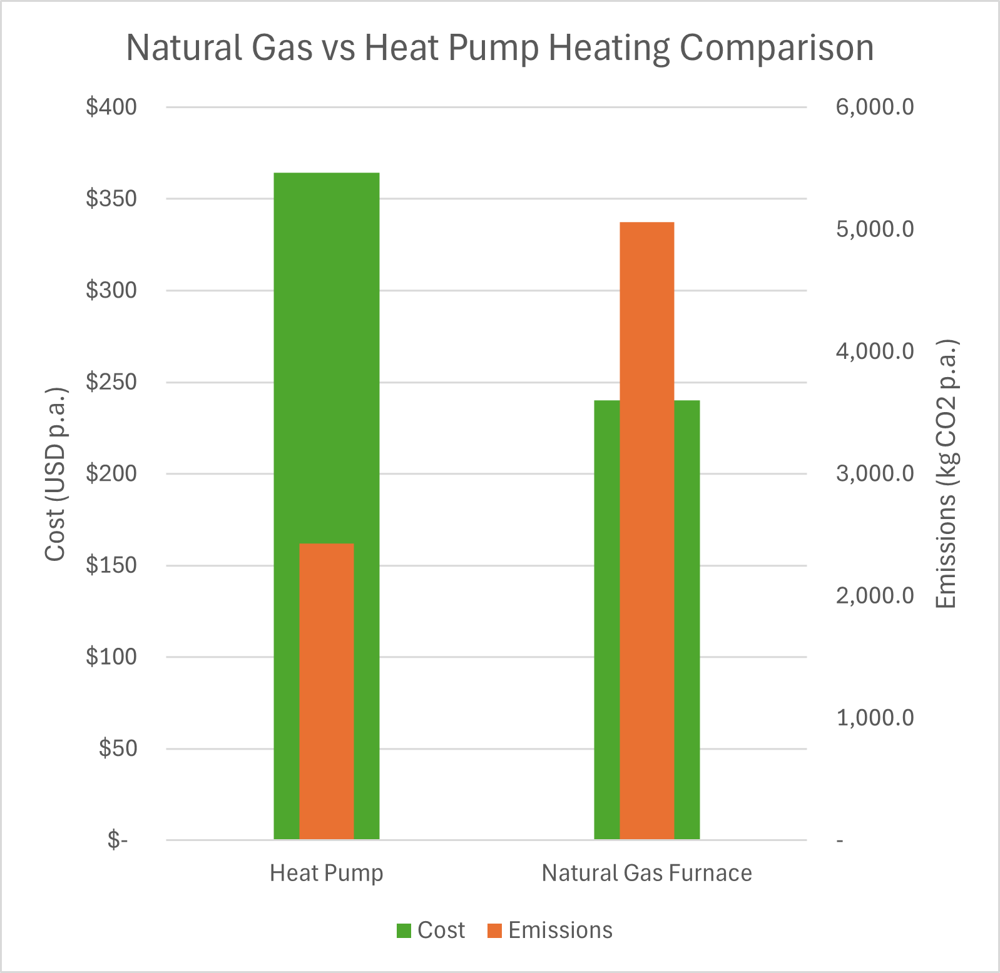

Charlestown, Boston Thermal Model 
======

This is a short study I ran in my downtime to familiarize myself with the Climate of Boston, local building standards and the new parametric function on IES. The small project was also used to analyse the effectiveness of heat pump vs natural gas furnace heating as well as optimal operation of our heater in terms of setpoint and schedule. The parametric study analysed future climate weather files for the region as well as the German custom of "Luften".

Rhino Model
======
Initially used to see if furniture could fit in our house, developed into the honeybee energy model for export to IES.

  

IESVE Model:
======

Rhino honeybee model exported into IES using Pollination suite of tools. Envelope thermal constructions sourced from the ASHRAE. Greenstar apartment templates used for internal gains and schedules. HVAC system: Wall FCU with central heat pumps and air cooled chillers.  

  

 
Monthly Energy Results from IES:
======
To be used to target efficiency measure and to benchmark against energy bills :P.  

  

 
Natural Gas vs Electric Heat Pump Comparison:
======
A hypothetical study of the cost and emissions of our house if we had natural gas heating as it had previously. Gas heating would have been 34% cheaper per year, but would have emitted 208% more CO2 to run.
_Cost data from US Bureau of Labor Statistics, 2024. Cost data does not include fixed rates for gas and electricity service.
Emissions data from US Energy Information Administration, 2023_  

  

Parametric Study of the Effects of Luften and Future Climate Scenarios:
======

Coming from a temperate environment without a real need for heating, I thought I should test out the new IES parametric tool on the German concept of "Luften" for our Boston home. Understandably luften vastly increased the heating requirements of the home (approximately $150 extra a year in electricity costs), but led to consistently low CO2 levels in an occupied home.   

<a href='../files/Parametric Report 2025-01-16_20-35-24/report.html'>Link to Parallel Axis and Stacked Plots </a>

  

