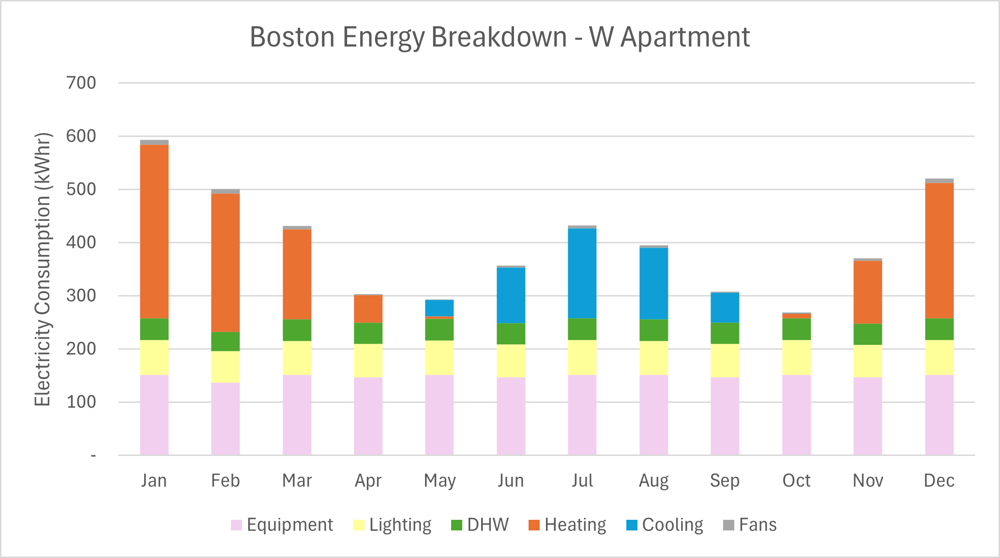

This is a short study I ran in my downtime to familiarize myself with the Climate of Boston, local building standards and the new parametric function on IES. The small project was also used to analyse the effectiveness of heat pump vs natural gas furnace heating as well as optimal operation of our heater in terms of setpoint and schedule. The parametric study analysed future climate weather files for the region as well as the German custom of "Luften" (Permumtations 4,5,6).

Rhino Model: 
Initially used to see if furniture could fit in our house, developed into the honeybee energy model for export to IES.
  
IESVE Model:
  
  Monthly Energy Results from IES:
  To be used to benchmark agaisnt energy bills :p
  
  Natural Gas vs Electric Heat Pump Comparison
  
  
  <a href='../files/Parametric Report 2025-01-16_13-39-31/report.html'>Boston House Parametric Study of the Effects of Luften and Future Climate Scenarios:</a>

  

