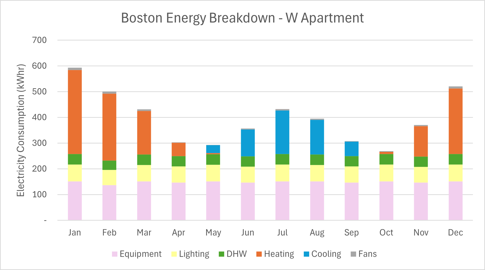
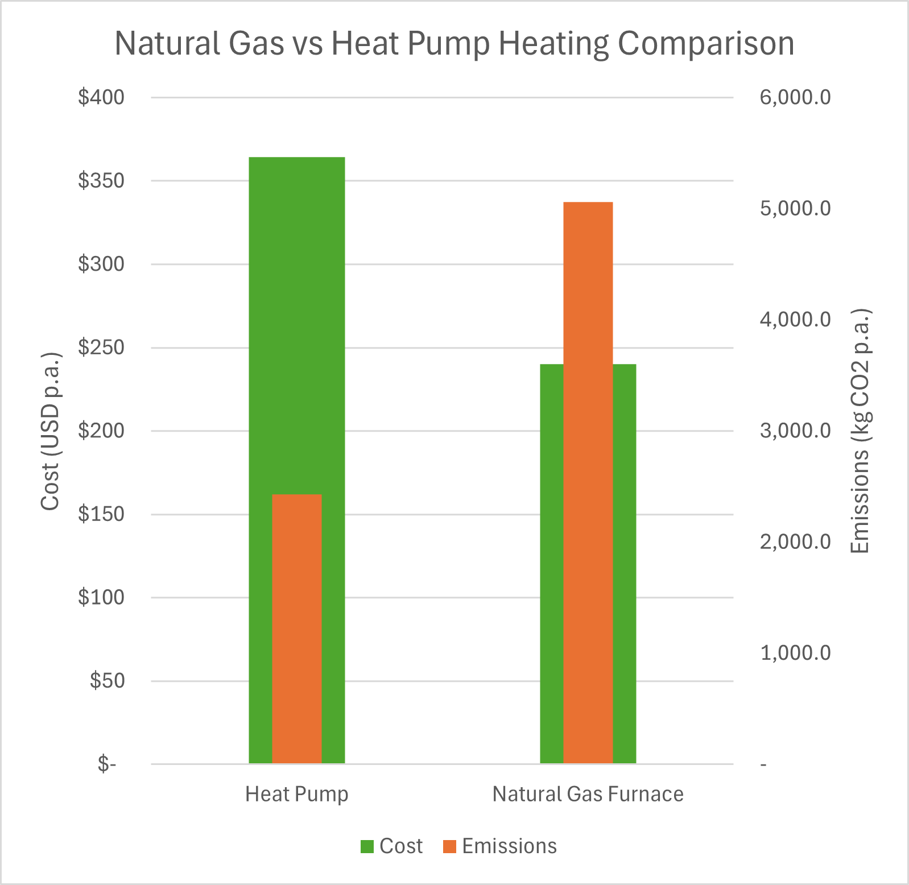
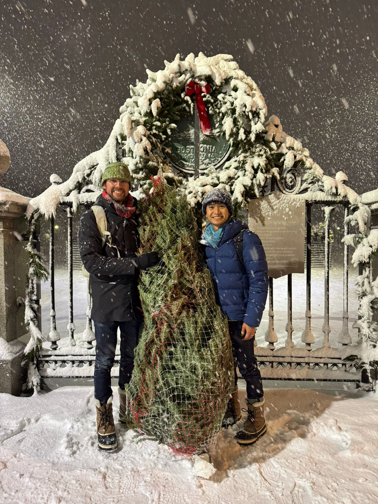
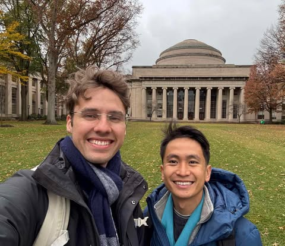
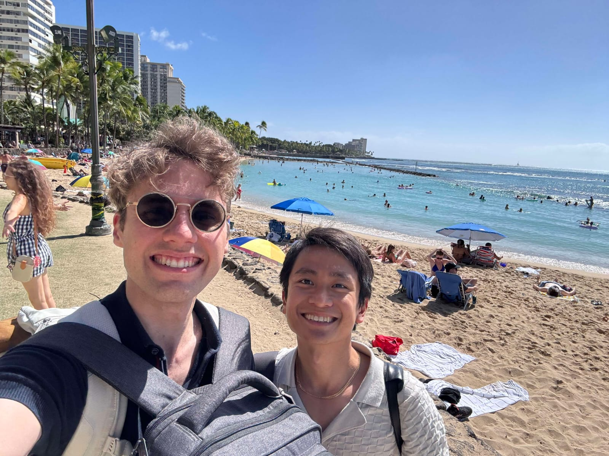
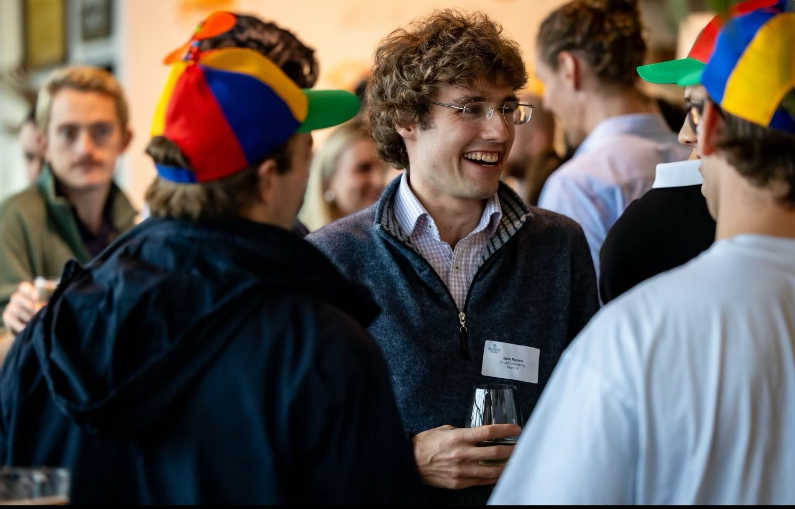

About Me
======

I currently work as a Sustainability Engineer at <a href="https://www.e-lab.com.au/our-people">E-Lab</a> a specialist consultancy at their Sydney Office. With my background in mechanical engineering and thermodynamics I specialise in building simulation to aid in architectural design and optimised outcomes for clients in cost, wellness and carbon impact. I have also worked across other aspects of sustainability including delivering sustainable ratings, energy estimation for compliance, embodied carbon, thermal comfort and daylight assessments. Overall, I relish the opportunity to explore further in sustainability and collaborate with the amazing people in this field.

Recent News
======
09/01/2025 - Nothing like arriving in a new climate to run a IES Thermal Model of your own apartment: 
Rhino Model

IESVE from Rhino Export

Energy Results

Future Climate Results

Natural Gas vs Electric Heat Pump Comparison

20/12/24 - Tree Shopping in the Snow! 

25/11/24 - Arriving in Boston! 

15/11/24 - Arriving in America, quick stop through Honolulu! 

20/06/24 - Groovy times at Green Building Day! 

06/06/24 - Property Council of Australia Future Directions Lawn Bowls! 

[Click Here for more news](https://www.linkedin.com/in/jack-madew-14814216b/)

Portfolio Snapshot
======

|  |  |  |
|---|---|---|
| 8 Kippax St, Surry Hills – Thermal Envelope Compliance, NABERS, Parametric, Solar, Mixed Mode and Natural Ventilation Studies | QVB, The Strand, The Galeries – Advanced thermal comfort, daylight and glare studies for centre skylights | 525 George St, Sydney – Natural Ventilation Assessment for Residential Development, Reflectivity Study |
| 435 Bourke St, Melbourne – Façade impact on energy analysis | 24 Bay St, Double Bay – Thermal Envelope Compliance assessment for heritage commercial development | 8 Boorea St, Lidcombe – Green Star Buildings, Thermal Envelope Compliance, Energy for industrial Warehouses |
| 270 Pitt St, Sydney – NABERS Energy and Water Assessments | CVC Capital, Barangaroo – Green Star Interiors Assessment | The Greens, Norwest Business Park – NatHERS Assessment Large Scale Residential |
| Square Kilometre Array (SKA) – Data Centre Advanced HVAC Energy and Load Modelling | Jessie St Centre, Parramatta – Reflectivity Study, Sustainable Opportunities | Oran Park, Sydney – PV generation assessment, Thermal Comfort Study |
| QEII Hospital, Brisbane – Thermal Envelope Compliance, parametric façade study, energy modelling for Hospitals | Angliceare Bateau Bay Redevelopment – BASIX assessment aged care development | Avalon House, Sydney – High end sustainability for single dwelling |
| Young Husband Wool Sheds Redevelopment, Kensington – NABERS Energy assessment | Yamba Community Precinct – Thermal Envelope Compliance assessment for complex building geometry | Castle towers Office, Hotel, Shopping Centre, Castle Hills – NABERS Energy and Water, Natural Ventilation Study |
| Bansktown Town Centre and Compass Centre, Bankstown – Sustainable master planning with site wind comfort study | St Vincent’s College, Potts Point – ESD opportunities analysis | St Ives Cultural Education Centre, St Ives – Thermal comfort and natural ventilation study |
| Sydney Metro Western Sydney Airport – Heat resilience, glare and daylight analysis | TAFE NSW – WELL HSR Assessment |  |

