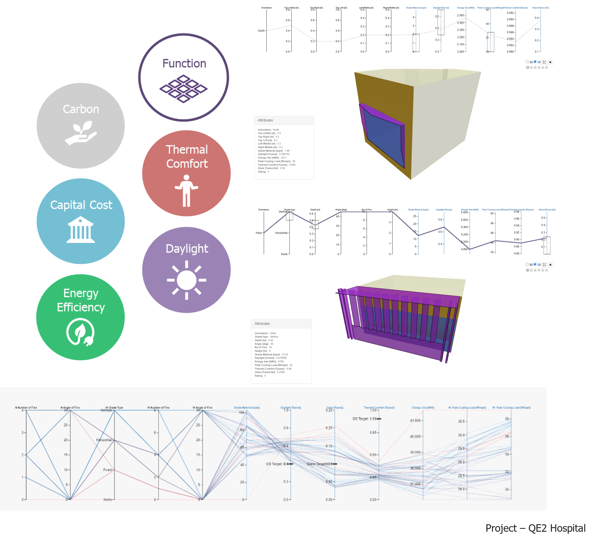
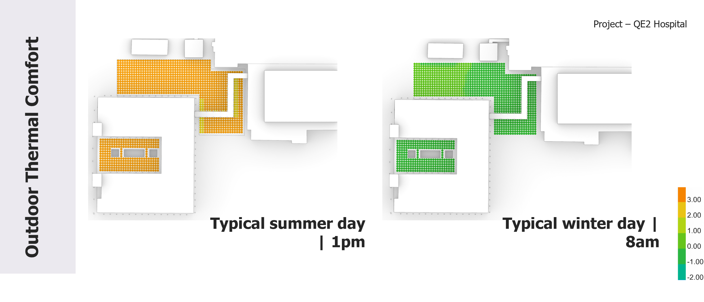
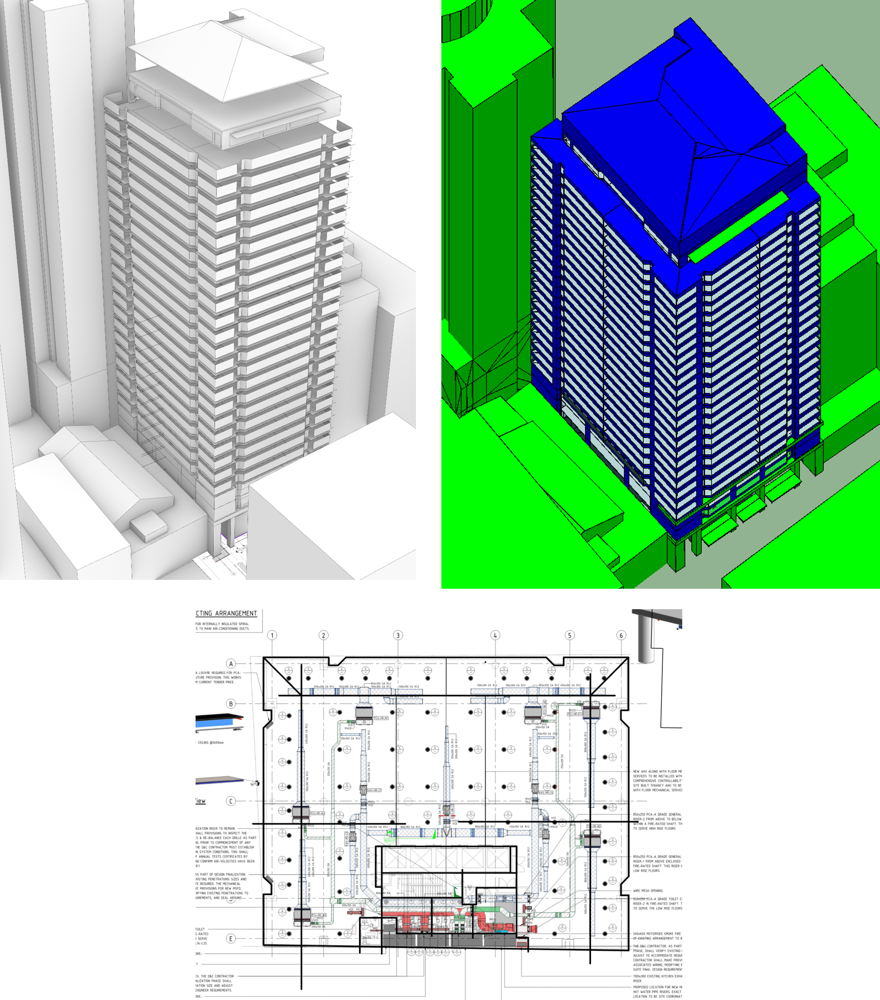
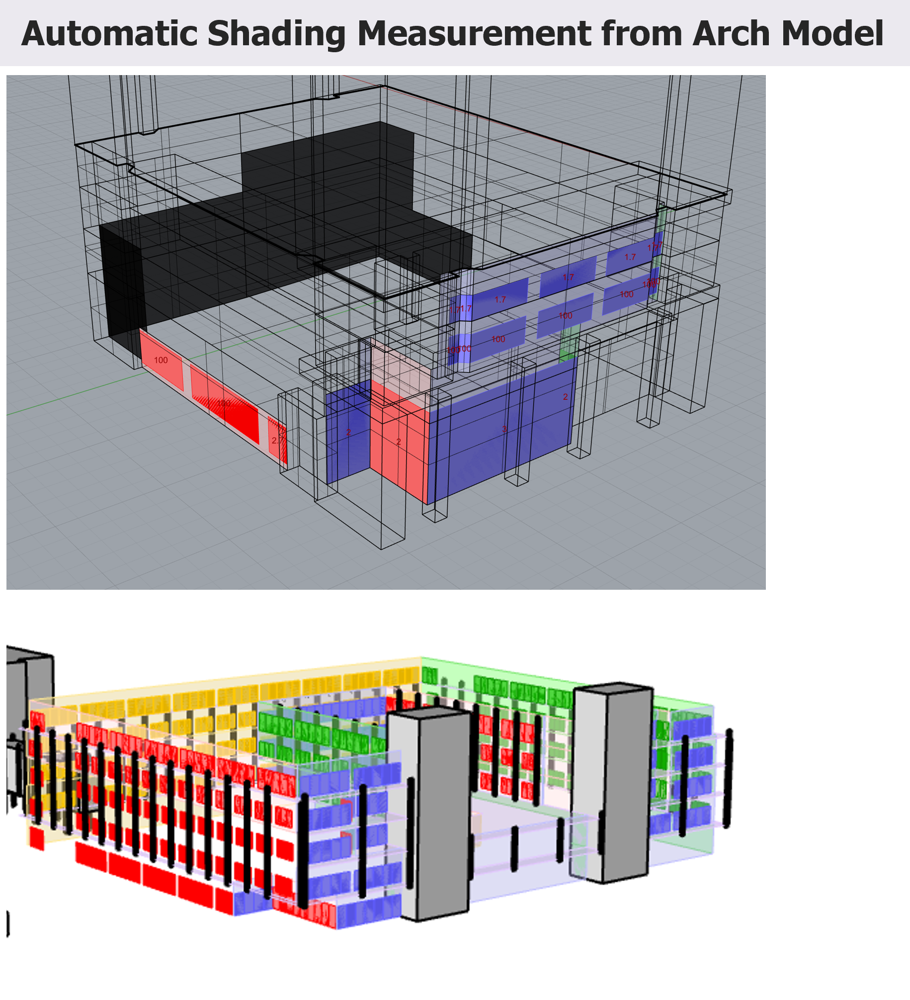
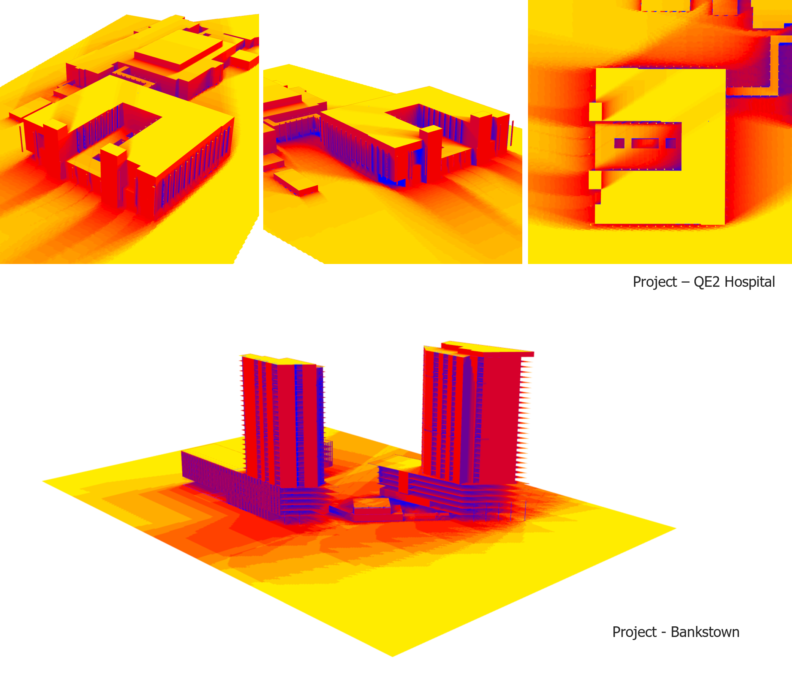
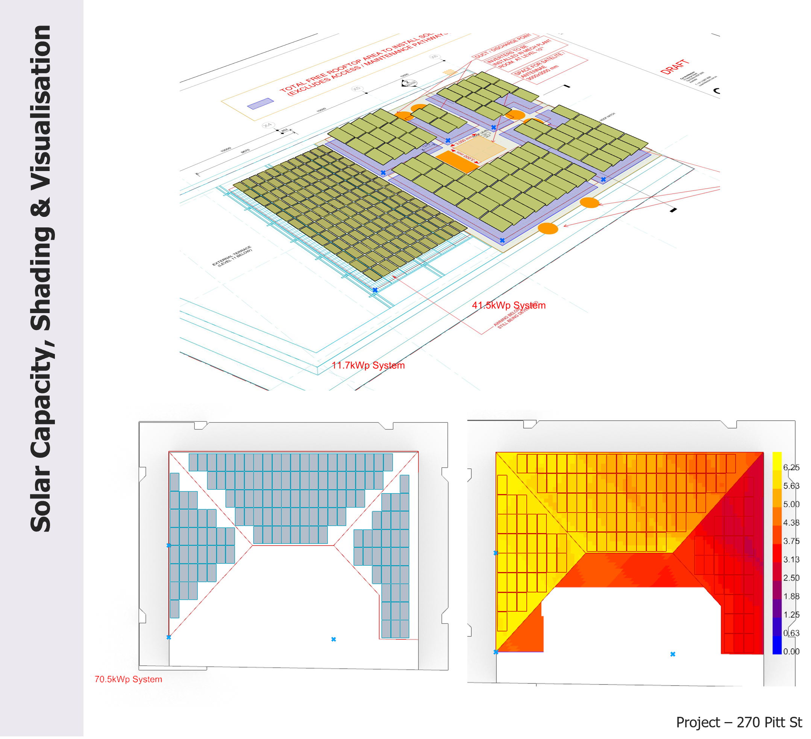

---
title: "Portfolio item number 1"
excerpt: "Short description of portfolio item number 1 "

Commercial: 8 Kippax St, Surry Hills, Sydney, NSW
======
Adaptive re-use of an existing building into a high quality commercial asset. <a href="https://tt-acm.github.io/DesignExplorer/?ID=BL_3Qg15UU"> Parametric study </a> of existing facade design to optimise for daylight, glare, aesthetics, load and energy use. Biosolar roof, natural ventilated winter gardens and mixed mode operating conference meeting area.

 

Historic Retail: Queen Victoria Building and the Strand, Sydney, NSW
======
Daylight and glare modelling study of potential skylight improvement scenarios to heritage shopping centres. Including thermal comfort analysis on multiple floors with impact of future climate scenario modelled. 

Medical: Queen Elizabeth II Jubilee Hospital Expansion, Coopers Plain, QLD
======
Large scale hospital expansion in Brisbane Queensland. Delivering on NABERS Energy and Water targets in a difficult operational scenarios.

 
Optimised facade through <a href="https://tt-acm.github.io/DesignExplorer/?ID=BL_3KZzcgI"> parametric study </a> with considerations for glare, load and daylight access. 

Outdoor thermal comfort study with future climate projections to maintain resilience.

Transport: Sydney Metro Western Sydney Airport Connection, 12 x Station Delivery, NSW
======
Heat resilience, views, advanced glare and daylight analysis for multiple stations along Sydney Metro Line.

 

  

 

Additional Rhino Tool Development
======

collection: portfolio

