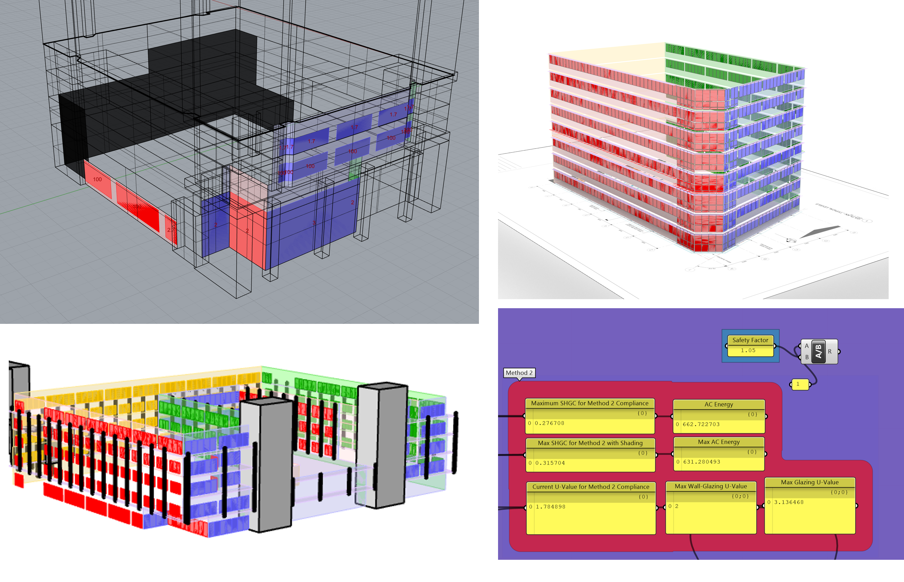
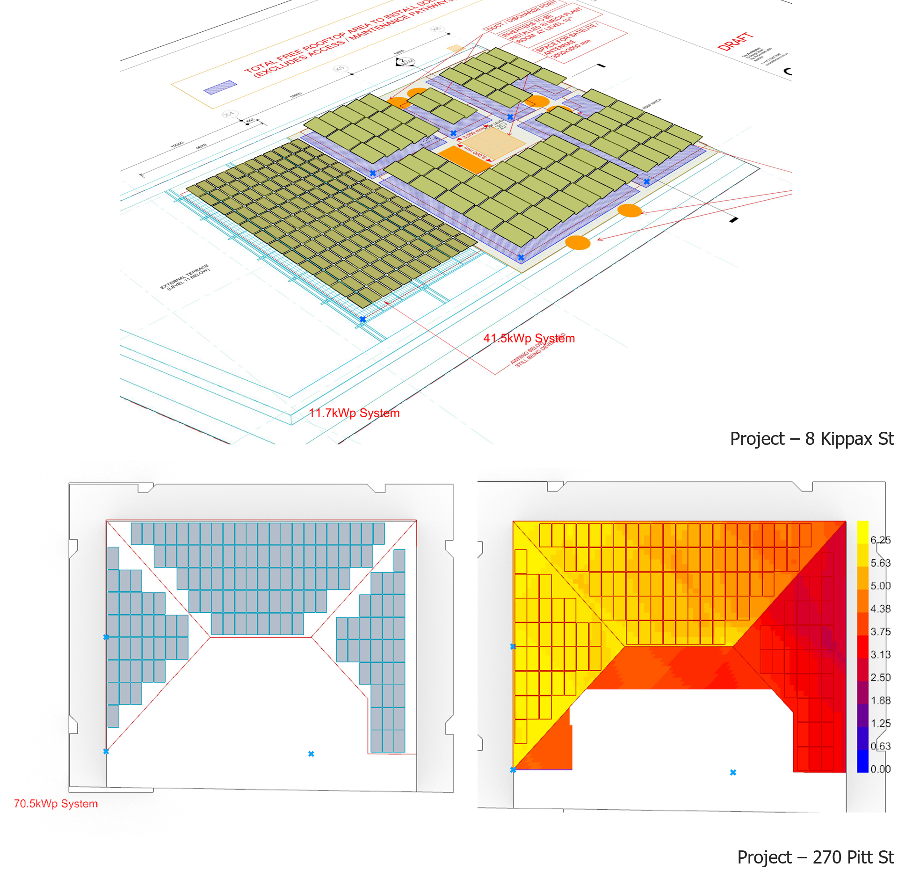

Commercial: 8 Kippax St, Surry Hills, Sydney, NSW
======

Adaptive re-use of an existing building into a high quality commercial asset. <a href="https://tt-acm.github.io/DesignExplorer/?ID=BL_3Qg15UU"> Parametric study </a> of existing facade design to optimise for daylight, glare, aesthetics, load and energy use. Biosolar roof, natural ventilated winter gardens and mixed mode operating conference meeting area.

Historic Retail: Queen Victoria Building and the Strand, Sydney, NSW
======

Daylight and glare modelling study of potential skylight improvement scenarios to heritage shopping centres. Including thermal comfort analysis on multiple floors with impact of future climate scenario modelled. 

Medical: Queen Elizabeth II Jubilee Hospital Expansion, Coopers Plain, QLD
======

Large scale hospital expansion in Brisbane Queensland. Delivering on NABERS Energy and Water targets in a difficult operational scenarios.

 

Optimised facade through <a href="https://tt-acm.github.io/DesignExplorer/?ID=BL_3KZzcgI"> parametric study </a> with considerations for glare, load and daylight access. 

Outdoor thermal comfort study with future climate projections to maintain resilience.

Transport: Sydney Metro Western Sydney Airport Connection, 12 x Station Delivery, NSW
======

Heat resilience, views, advanced glare and daylight analysis for multiple stations along Sydney Metro Line.

 

  

 

Additional Rhino Tool Development
======

Energy model development accelerated by using architectural models directly, extracting and simplifying windows and floorplate locations to deliver accurate energy and daylight models quickly.

Direct sunhours analysis using Ladybug tools for initial site analysis and facade recommendations

Solar Array generator developed in Rhino with automatic sizing and in-built radiation analysis

Wind studies using OpenFOAM CFD within Rhino

Small parametric studies with 2 sets of input parameters

